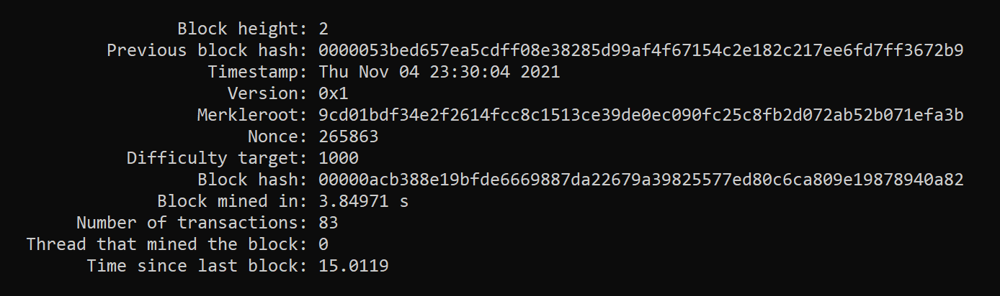

# Supaprastintos blokų grandinės (blockchain) kūrimas.

## Programos veikimas

1. Programa sugeneruoja **1000** vartotojų, kurie turi šiuos atributus:
    * name;
    * public key;
    * balance.
2. Sugeneruojamos **10'000** transakcijų, turinčių šiuos atributus:
    * id (hash of sender's and receiver's public keys and sum transfered);
    * sender's public key;
    * receiver's public key;
    * sum transfered;
3. Tikrinamos ir validuojamos nesuklastotos transakcijos. Taip pat tikrinama ar siuntėjo norima persiųsti suma yra ne didesnė už jo sąskaitos balansą. Sėkmingos transakcijos bus priskirtos naujam blokui.
4. Pradedamas bloko kasimo procesas. Pasinaudojant openMP, vienu metu pradedami kasti 5 individualūs blokai.
Kasimui skiriamos 5 sekundės. Jei nė vienas *thread*'as neranda bloko per 5 sekundes, laiko limitas pratęsiamas iki 10 sekundžių.

5. Į blokų grandinę pridedamas greičiausiai surastas blokas (iš 5 potencialių).

**Note:** hash'avimui naudojama *sha256* funkcijos implementacija, nes ankščiau sukurta *hash* funkcija nėra pakankamai
efektyvi, kad galėtų būti naudojama blokų kasimui.

### Konsolėje rodoma ši informacija apie iškastą bloką:
